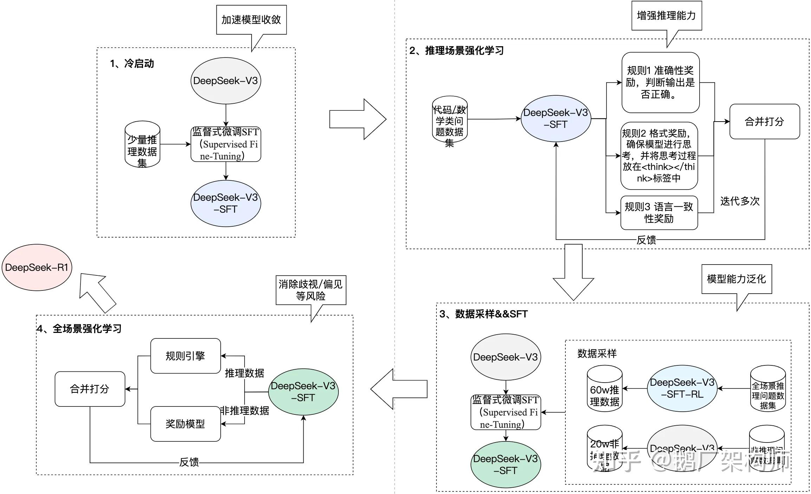

# DeepSeek R1训练流程

下图概括了 DeepSeek R1 从基础模型、冷启动样本到强化学习与蒸馏的整体流程，适合作为理解“推理能力如何在后训练阶段逐步塑形”的补充材料。

如果在组会上展开讲解，可以重点关注三点：

- 为什么先做 cold start / SFT，给模型一个可用的初始策略
- 为什么后续还要引入强化学习，进一步提升推理与决策能力
- 为什么最终还要蒸馏到更小模型，以便部署和复用
