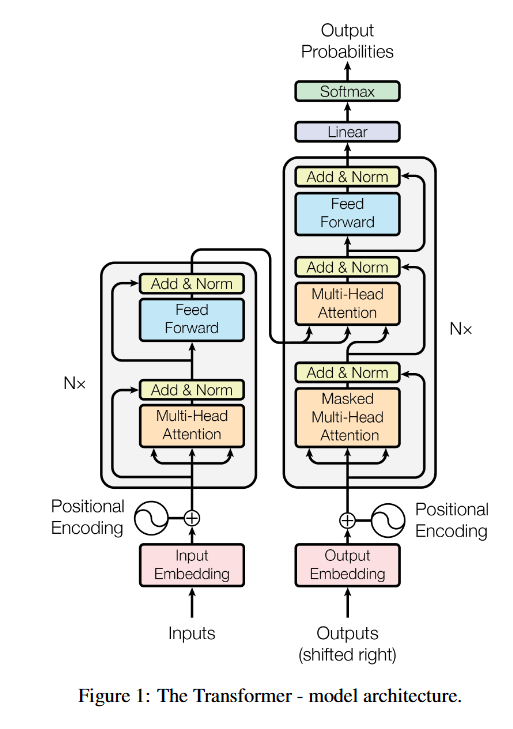
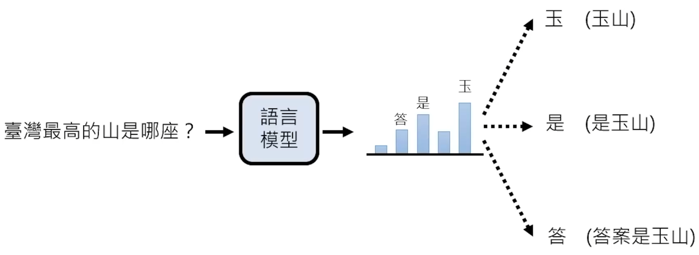
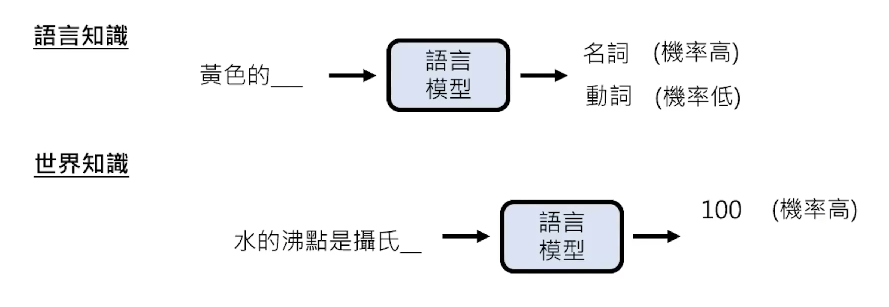

# 什么是大语言模型，如何使用和接入大语言模型

大型语言模型（英语：large language model，LLM），也称大语言模型，简称大模型，是一种基于人工神经网络的语言模型。其名称中的“大型”指模型具有庞大的参数量（通常在数十亿至数万亿级别，如 GPT-3 含 1750 亿参数）以及巨大的训练数据规模。大语言模型通常采用自监督机器学习方法，从而能够基于海量无标注的文本进行训练。

​

**[Attention is all you need.pdf](assets/1706.03762v7-20251029172910-yni5x2o.pdf)**

### Step 1：估计下一个 token 的概率分布

$$
y_{t+1} = P(x_{t+1}\mid x_1,x_2,\dots,x_t)
$$

这里：

- $x_1,\dots,x_t$ 是已经输入的上下文
- $y_{t+1}$ 是对整个词表的概率分布

比如词表大小是 $V$，那：

$$
y_{t+1}\in \mathbb{R}^{V}
$$

其中第 $i$ 维表示“第 $i$ 个 token 是下一个输出”的概率。

### Step 2：按照策略选出下一个 token

$$
x_{t+1} = \text{Sample}(y_{t+1})
$$

这里的 `Sample`​ 不一定真的是随机采样，也可以是：

- **贪心选择**：

$$
x_{t+1} = \arg\max_i y_{t+1}^{(i)}
$$

- **温度采样**：

$$
P_i = \frac{\exp(z_i/\tau)}{\sum_j \exp(z_j/\tau)}
$$

- **top-k / top-p 采样**

然后把选出来的 $x_{t+1}$ 拼回输入，再继续预测 $x_{t+2}$。

所以生成过程是循环的：

$$
x_1,x_2,\dots,x_t
\rightarrow x_{t+1}
\rightarrow x_{t+2}
\rightarrow \dots
$$

​

​

# 选择一个合适的大模型

## 大模型竞技场

1. [Overview Leaderboard | LMArena](https://lmarena.ai/leaderboard)

2. [CompassArena](https://arena.opencompass.org.cn/)
3. [Open LLM Leaderboard - a Hugging Face Space by open-llm-leaderboard](https://huggingface.co/spaces/open-llm-leaderboard/open_llm_leaderboard#/)
4. [Chatbot Arena + | OpenLM.ai](https://openlm.ai/chatbot-arena/)

根据各项测试的得分来进行排名，不同的榜单有所侧重，仅作参考。

## 几个推荐的大模型

下面列的是常见代表模型，主要用于帮助建立选型概念；实际使用时还需要结合预算、上下文长度、多模态能力、代码能力和部署方式来判断。

### 闭源模型

1. [Gemini 3.1 Pro](https://gemini.google.com/u/0/app?pageId=none) (多模态)
2. [Google ai studio 中的 Gemini 3.1 Pro](https://aistudio.google.com/prompts/new_chat) （多模态）长文本理解（最大输入上下文长度为1M token）
3. Claude 4.6 （多模态）代码工作（如内置于cursor、copilot、Trae中的Claude模型，或者Claude Code）
4. [ChatGPT 5.4](https://chatgpt.com/)（多模态）（解决复杂问题）
5. 豆包 （多模态）中文能力强，可以用来进行中文互联网搜索
6. Grok 马斯克家的闭源模型

### 开源模型

1. [Qwen系列：最新为Qwen3.6](https://qwen.ai/blog?id=qwen3.6)
2. [DeepSeek V3.2 R1](https://www.deepseek.com/en/)
3. LLAMA
4. Kimi 2
5. [ChatGLM](https://z.ai/subscribe)

## 如何接入/部署一个大模型

1. 使用 API 接入在线大模型（以 DeepSeek 为例），可参考 [DeepSeek_API示例_可直接运行.ipynb](assets/DeepSeek_API示例_可直接运行-20260414125227-ezjq1pj.ipynb)
2. 使用 [Ollama](https://ollama.com/) 或 [LM Studio](https://www.lm-studio.me/) 等工具在本地部署一个大模型，并通过 HTTP 或 API 请求方式连接它

    [Ollama_qwen2.5_API_and_HTTP.ipynb](assets/Ollama_qwen2.5_API_and_HTTP-20260414144442-0z76o1y.ipynb)

3. 使用从 [Hugging Face](https://huggingface.co/) 或 [ModelScope](https://www.modelscope.ai/home) 下载的模型进行本地部署

    [Local_Transformers_Qwen3_0.6B_api.ipynb](assets/Local_Transformers_Qwen3_0.6B_api-20260414144452-2qs91te.ipynb)
