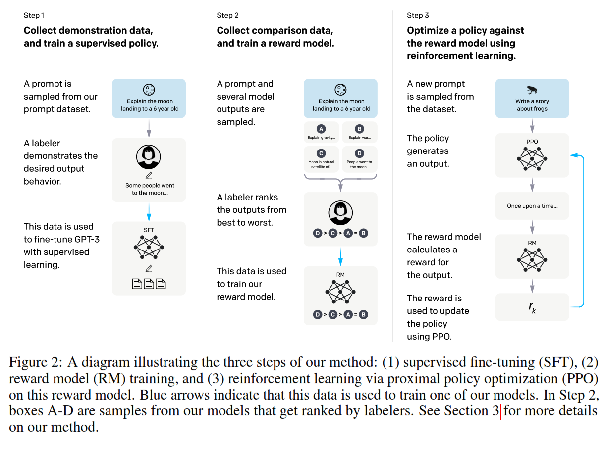
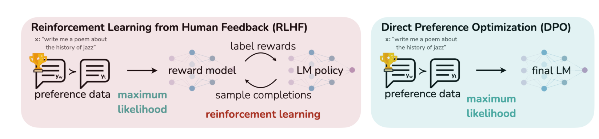

# 偏好优化RLHF与DPO

## 1. Reinforcement Learning from Human Feedback（RLHF，人类反馈强化学习）

[RLHF.pdf](assets/RLHF-20260414162641-5d3mfj0.pdf)

这篇论文指出：预训练语言模型原本优化的目标是**预测下一个 token**，但真实产品里我们希望它做到的是**有帮助、真实、安全地遵循用户指令**。这两个目标并不完全一致，也就是常说的 alignment 问题。

假设用户问：“帮我写一封礼貌的催稿邮件。”预训练模型可能会出现下面几类问题：

- 没完全按要求写
- 写得啰嗦，不像真实邮件
- 在某些问题上胡编
- 面对敏感请求时给出不合适的内容

这些问题的根源，不一定是模型“不会写字”，而是模型还没有被直接训练成“按人类偏好输出”。论文把目标概括为三点：**helpful、honest、harmless**，也就是有帮助、真实、无害。

### 为什么只做 SFT 还不够？

- “好回答”往往很难写成唯一标准答案
- 很多偏好更适合做“相对比较”，而不是“绝对打标签”

**核心思路是：不直接手写一个复杂的“好回答评分函数”，而是先从人类偏好比较中学习出一个奖励模型，再用这个奖励去优化语言模型。**

### 为什么要引入奖励模型 Reward Model？

**人类不可能在训练过程中每一步都实时上线打分。**

所以通常会增加一个中间层：

1. 先收集一批人类偏好比较数据
2. 用这些数据训练一个奖励模型
3. 让这个模型近似代替人类偏好打分

这个模型就是 **Reward Model（RM）**。

论文中，RM 输入的是 prompt $x$ 和 completion $y$，输出一个标量 $r_\theta(x,y)$。这个分数越高，表示越符合标注员偏好。

### RLHF 的基本流程

#### 1. SFT

先收集 demonstrations，训练一个监督策略 $\pi_{\text{SFT}}$。

目标可以写成：

$$
\max_{\pi_{\text{SFT}}}
\mathbb{E}_{(x,y)\sim D_{\text{demo}}}
[\log \pi_{\text{SFT}}(y|x)]
$$

这里 $D_{\text{demo}}$ 是人工示范数据。  
这一步的作用，是把 base LM 拉到一个“基本会按指令回答”的起点。

#### 2. Reward Model（RM）

对同一个 prompt $x$，生成多个回答，让标注员排序，得到偏好对 $(y_w, y_l)$，其中 $y_w$ 是 preferred，$y_l$ 是 less preferred。

RM 的目标是让 preferred answer 拿更高分。论文给出的损失是：

$$
\mathcal{L}_{RM}(\theta)=
-\mathbb{E}_{(x,y_w,y_l)\sim D}
\left[
\log \sigma(r_\theta(x,y_w)-r_\theta(x,y_l))
\right]
$$

这里 $\sigma$ 是 sigmoid。

#### 3. PPO

从 $\pi^{SFT}$ 初始化 $\pi^{RL}$，对每个 prompt $x$：

1. 采样回答 $y \sim \pi^{RL}(\cdot|x)$
2. 用 RM 计算奖励 $r_\theta(x,y)$
3. 加上 KL penalty 和可选的 pretraining mix
4. 用 PPO 更新 $\phi$

优化目标：

$$
\max_{\phi}
\mathbb{E}_{(x,y)\sim D_{\pi_{\phi}^{RL}}}
\left[
r_{\theta}(x,y)
-
\beta \log \frac{\pi_{\phi}^{RL}(y|x)}{\pi^{SFT}(y|x)}
\right]
+
\gamma \mathbb{E}_{x\sim D_{\text{pretrain}}}
[\log \pi_{\phi}^{RL}(x)]
$$

这就得到最终的 InstructGPT 策略。

## 2. 从 RLHF 到 DPO

RLHF 需要单独训练奖励模型，还要进行 PPO 优化，整体流程更复杂、训练成本也更高。DPO 的出发点，就是把这条链路尽量简化。

对每个 prompt $x$，考虑下面这个目标：

$$
\max_{\pi}
\;
\mathbb{E}_{y\sim \pi(\cdot|x)}[r(x,y)]
-
\beta D_{\mathrm{KL}}(\pi(\cdot|x)\|\pi_{\text{ref}}(\cdot|x))
$$

先把 $x$ 固定住看。

这个问题有一个解析形式的最优策略：

$$
\pi^*(y|x)
=
\frac{1}{Z(x)}
\pi_{\text{ref}}(y|x)\exp\left(\frac{1}{\beta}r(x,y)\right)
$$

其中 $Z(x)$ 是归一化常数。

这个式子非常重要，它说明：

> 在 KL 正则下，最优策略等于“参考策略 × 奖励指数加权”。

对它取对数：

$$
\log \pi^*(y|x)
=
\log \pi_{\text{ref}}(y|x)
+
\frac{1}{\beta}r(x,y)
-
\log Z(x)
$$

移项可得：

$$
r(x,y)
=
\beta \log \frac{\pi^*(y|x)}{\pi_{\text{ref}}(y|x)}
+
\beta \log Z(x)
$$

注意对于固定的 $x$，$\log Z(x)$ 与 $y$ 无关。  
所以对同一个 prompt 下的两个回答 $y_w, y_l$ 做差：

$$
r(x,y_w)-r(x,y_l)
=
\beta
\left[
\log \frac{\pi^*(y_w|x)}{\pi_{\text{ref}}(y_w|x)}
-
\log \frac{\pi^*(y_l|x)}{\pi_{\text{ref}}(y_l|x)}
\right]
$$

也可写成：

$$
r(x,y_w)-r(x,y_l)
=
\beta \log
\frac{\pi^*(y_w|x)/\pi_{\text{ref}}(y_w|x)}
{\pi^*(y_l|x)/\pi_{\text{ref}}(y_l|x)}
$$

现在把上面的奖励差替换进去：

$$
P(y_w \succ y_l|x)
=
\sigma\left(
\beta \log
\frac{\pi^*(y_w|x)/\pi_{\text{ref}}(y_w|x)}
{\pi^*(y_l|x)/\pi_{\text{ref}}(y_l|x)}
\right)
$$

如果我们不去先学 $r$，而是直接让当前策略 $\pi_\theta$ 去拟合这个最优策略 $\pi^*$，就得到 DPO 的目标：

$$
\mathcal{L}_{\text{DPO}}(\theta)
=
-\mathbb{E}_{(x,y_w,y_l)}
\left[
\log \sigma\left(
\beta
\log
\frac{\pi_\theta(y_w|x)/\pi_{\text{ref}}(y_w|x)}
{\pi_\theta(y_l|x)/\pi_{\text{ref}}(y_l|x)}
\right)
\right]
$$

展开一点：

$$
\mathcal{L}_{\text{DPO}}(\theta)
=
-\mathbb{E}_{(x,y_w,y_l)}
\left[
\log \sigma\left(
\beta
\left(
\log \pi_\theta(y_w|x)-\log \pi_\theta(y_l|x)
-\log \pi_{\text{ref}}(y_w|x)+\log \pi_{\text{ref}}(y_l|x)
\right)
\right)
\right]
$$

$$
\theta \leftarrow \theta - \eta \nabla_\theta \mathcal{L}_{\text{DPO}}
$$

这就是 DPO 的标准形式。

其中，

$$
\log \frac{\pi_\theta(y_w|x)}{\pi_\theta(y_l|x)}
\;-\;
\log \frac{\pi_{\text{ref}}(y_w|x)}{\pi_{\text{ref}}(y_l|x)}
$$

表示的是：**当前模型相对于参考模型，是否更偏向 winner 而不是 loser。**

DPO 的训练逻辑可以概括为：

- 提高 preferred answer 的概率
- 降低 dispreferred answer 的概率
- 但这种提升或降低，是**相对于参考模型**来衡量的

### 样本处理

DPO 的核心训练单元不是单条 $(x, y)$，而是一个**偏好对**：

$$
(x,\; y_w,\; y_l)
$$

其中：

- $x$：prompt / 指令 / 上下文
- $y_w$：chosen / winner，人类更偏好的回答
- $y_l$：rejected / loser，人类不太喜欢的回答

DPO 需要的是：

$$
\log \pi_\theta(y_w|x)
\quad\text{和}\quad
\log \pi_\theta(y_l|x)
$$

以及参考模型的：

$$
\log \pi_{\text{ref}}(y_w|x)
\quad\text{和}\quad
\log \pi_{\text{ref}}(y_l|x)
$$

所以每个样本通常要算四个量：

- 当前模型对 chosen 的条件对数概率
- 当前模型对 rejected 的条件对数概率
- 参考模型对 chosen 的条件对数概率
- 参考模型对 rejected 的条件对数概率

再代入 DPO 损失：

$$
\mathcal{L}_{\text{DPO}}
=
-\log \sigma\left(
\beta
\left[
\log \pi_\theta(y_w|x)-\log \pi_\theta(y_l|x)
-\log \pi_{\text{ref}}(y_w|x)+\log \pi_{\text{ref}}(y_l|x)
\right]
\right)
$$

损失统计时，**只累加 response 部分 token 的 log-prob**，prompt 部分只是条件，不参与求和。

也就是：

$$
\log \pi(y|x)
=
\sum_{t \in \text{response tokens}}
\log \pi(y_t \mid x,y_{<t})
$$

这就要求训练时做一个 **mask**：

- prompt token 的 label mask 掉
- response token 才参与 log-prob 计算

- [Local_Transformers_Qwen3_0.6B_DPO_from_JSON.ipynb](assets/Local_Transformers_Qwen3_0.6B_DPO_from_JSON-20260414185307-m4dw5bc.ipynb)
