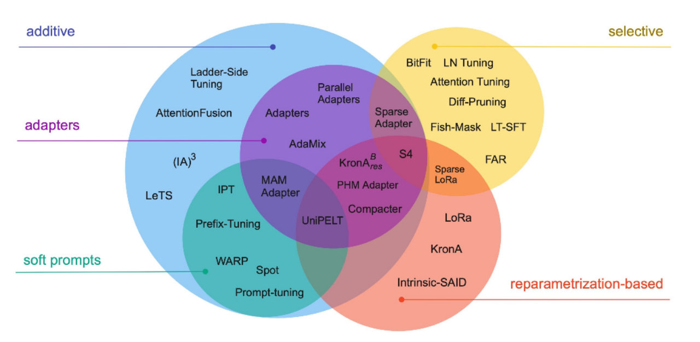
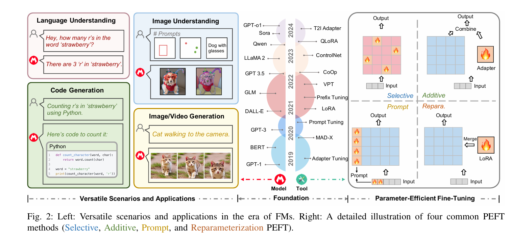

# 后训练参数更新方式：部分参数微调（Parameter-Efficient Fine-Tuning，PEFT）

## 为什么需要 PEFT？

- **显著降低训练成本**  
  PEFT 不需要更新整个大模型，只训练一小部分参数，因此能明显减少计算量、显存占用和训练时间。对大模型而言，这一点尤其关键，因为全量微调往往成本过高。
- **大幅减少存储开销**  
  传统全量微调通常意味着“一个任务对应一整套模型参数”，任务一多，存储成本会迅速膨胀；而 PEFT 只需保存少量任务相关参数或适配模块，更适合多任务场景。
- **在轻量化前提下保持较强性能**  
  Prefix-Tuning、LoRA 等工作都表明，只训练极少量参数，仍能取得与全量微调接近、甚至在某些设置下更好的效果。因此，PEFT 的价值不只是“省资源”，而是“在省资源的同时保持可用性能”。
- **更适合大模型时代的多任务部署与复用**  
  PEFT 支持“一个共享底座模型 + 多个轻量任务模块”的模式，使模型适配、版本管理、任务切换和部署维护都更灵活。

## 粗略估算一次全参数微调的显存开销

训练显存可以粗略拆成：

$$
\text{训练显存} \approx \text{模型参数} + \text{梯度} + \text{优化器状态} + \text{激活值} + \text{额外开销}
$$

1. **模型参数本身占多少显存？**

   如果模型总参数量为 $N$，每个参数占 $b$ 字节，那么：

   $$
   M_{\text{weights}} = N \cdot b
   $$

   常见精度对应的每参数字节数：

   - FP32：4 bytes
   - FP16 / BF16：2 bytes
   - INT8：1 byte
   - 4bit：0.5 byte

   以一个 7B 模型为例，若采用 FP16 权重：

   $$
   7 \times 10^9 \times 2 \approx 14\text{ GB}
   $$

   也就是说，**仅仅把 7B 模型以 FP16 放进显存**，就大约需要 **14 GB**。

2. **梯度开销**

   如果梯度也按 FP16 / BF16 存储：

   $$
   M_{\text{grads}} \approx N \cdot 2
   $$

3. **优化器状态**

   如果使用 Adam / AdamW，通常要存两组动量状态 $m, v$。若按 FP32 存储：

   $$
   M_{\text{optimizer}} \approx N \cdot 8
   $$

   因为两组状态、每组 4 bytes。

4. **激活值**

   激活值会随着 batch size、序列长度和网络深度变化，实际训练中往往还要额外占去数 GB 显存。

5. **权重副本等额外开销**

   很多混合精度训练还会保留一份 FP32 master weights：

   $$
   M_{\text{master}} \approx N \cdot 4
   $$

因此，经验上可以把全参数微调的单参数训练成本粗略记为 **16~20 bytes**。按这个量级估算，一个 8B 模型做全参数微调时，显存需求可能达到 **约 160 GB**。

## PEFT 的主要类型

点击下面任一分支进入对应专题：

- [重参数化PEFT（Reparameterization PEFT）](<后训练参数更新方式：部分参数微调（Parameter-Efficient Fine-Tuning，PEFT）/重参数化PEFT（Reparameterization PEFT）.md>)
- [选择性PEFT（Selective PEFT）](<后训练参数更新方式：部分参数微调（Parameter-Efficient Fine-Tuning，PEFT）/选择性PEFT（Selective PEFT）.md>)
- [附加式PEFT（Additive PEFT）](<后训练参数更新方式：部分参数微调（Parameter-Efficient Fine-Tuning，PEFT）/附加式PEFT (Additive PEFT).md>)
- [提示式PEFT（Prompt PEFT）](<后训练参数更新方式：部分参数微调（Parameter-Efficient Fine-Tuning，PEFT）/提示式PEFT (Prompt PEFT).md>)

## 参考资料

- [PEFT综述.pdf](assets/PEFT综述-20260414141700-7nsxwm3.pdf)
