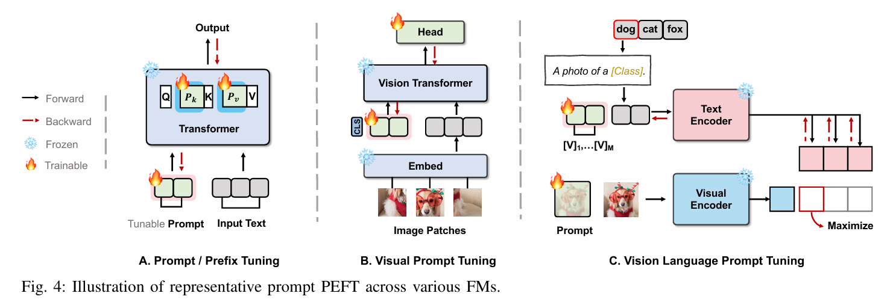

# 提示式PEFT（Prompt PEFT）

提示式 PEFT **完全不改变模型的任何原始参数**，而是通过在模型输入端或中间层添加一些可训练的连续向量，也就是“软提示”或“前缀”，来引导模型完成特定任务。

无论是文本提示、视觉提示还是多模态提示，其核心都是把可训练的 `Tunable Prompt` 向量与原始输入数据拼接或融合。

### Prompt Tuning（提示微调）

- **原理**：这是最简化的一种软提示方法。它只在输入嵌入层，将一系列可训练的“虚拟 token”向量拼接到真实输入 token 的嵌入序列之前。
- **公式**：若原始输入文本的嵌入序列为 $X_{\text{emb}} \in \mathbb{R}^{n \times d}$，可训练的软提示向量为 $P_{\text{emb}} \in \mathbb{R}^{p \times d}$，其中 $p$ 是提示长度，则模型实际接收的输入为：

  $$
  X'_{\text{emb}} = [P_{\text{emb}}; X_{\text{emb}}]
  $$

  在训练中，只有 $P_{\text{emb}}$ 被更新。

### Prefix-Tuning（前缀微调）

- **原理**：这是一种更强的提示方法。它不仅在输入层添加提示，还会在 Transformer 的**每一层**都加入可训练向量。具体来说，它为每一层自注意力模块的键（Key）和值（Value）序列都拼接一个“前缀”向量。
- **公式**：对于一个自注意力层，其原始的键和值矩阵为 $K, V$。Prefix-Tuning 会引入可训练前缀 $P_k, P_v$，并构造新的键和值：

  $$
  K' = [P_k; K]
  $$

  $$
  V' = [P_v; V]
  $$

  通过在每一层都施加这种引导，Prefix-Tuning 能对模型的生成过程进行更细致的控制。

### Visual Prompt Tuning（VPT）

- **原理**：将提示思想推广到视觉领域，在输入图像的 patch 序列中加入一系列可训练的“提示 patch”向量。

### 优点

- **参数极少**：通常比 Adapter 和 LoRA 需要训练的参数更少。
- **不改动底座模型**：基础模型可以完整共享，适合多任务场景。

### 缺点

- **可迁移性较弱**：为一个任务优化出来的提示向量，通常很难直接复用于另一个不相关任务。
- **模型依赖性强**：提示微调更像是“引导”模型调动已有能力，而不是补足模型本身没有的能力。
- **训练稳定性一般**：软提示训练有时不够稳定，需要更仔细地设置初始化和学习率。
