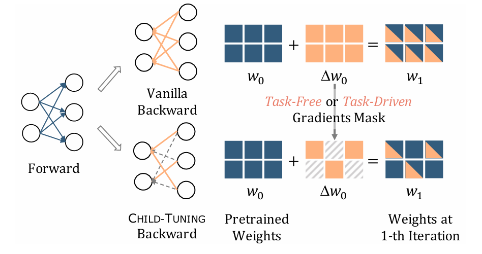

# 选择性PEFT（Selective PEFT）

选择性PEFT是参数高效微调中最直观的一类方法。其核心思想是：**从预训练模型已有的所有参数中，只选择一个非常小的子集进行微调，而将其余大部分参数完全冻结。**

### 1. 特定选择（Specific Selection）

这类方法简单直接，通常基于一些启发式假设。

#### BitFit（只微调偏置项）

[2106.10199v5.pdf](assets/2106.10199v5-20260414150849-z3i8bzh.pdf)

- **原理**：BitFit 是这类方法中最具代表性的工作。它基于一个大胆的假设：仅仅调整模型中的**偏置项（bias terms）**，就足以让模型适应新任务。因为在线性变换 $y = Wx + b$ 中，权重矩阵 $W$ 负责特征转换，而偏置项 $b$ 负责平移，调整平移就可以在一定程度上改变模型的输出分布。由于偏置项的数量远少于权重参数，通常不到总参数的 0.1%，因此这种方法极其高效。
- **论文中的公式（Equation 1）**：  
  论文以 BERT 为例，展示了其自注意力头中的计算。对于第 $l$ 层的第 $m$ 个注意力头，其查询（Q）、键（K）、值（V）的生成如下：

  $$
  Q_{m,l}(x) = W_{m,l}^q x + \color{blue}b_{m,l}^q
  $$

  $$
  K_{m,l}(x) = W_{m,l}^k x + \color{blue}b_{m,l}^k
  $$

  $$
  V_{m,l}(x) = W_{m,l}^v x + \color{blue}b_{m,l}^v
  $$

  在 BitFit 中，所有的权重矩阵 $W_{m,l}^q, W_{m,l}^k, W_{m,l}^v$ 都被冻结，只有蓝色的偏置向量 $\color{blue}b_{m,l}^q, \color{blue}b_{m,l}^k, \color{blue}b_{m,l}^v$ 是可训练的。

#### 其他特定选择方法

- **Freeze Layers**：只微调 Transformer 模型最后几层的参数，冻结靠近输入层的参数，因为底层参数通常学习更通用的特征，而高层参数更接近具体任务。
- **PASTA**：只微调与特殊 token（如 `[CLS]`、`[SEP]`）相关的参数。

### 2. 自动选择（Automatic Selection）

与预先设定规则不同，这类方法更灵活，也更强调“让模型自己决定哪些参数值得更新”。

#### Masking-based & Diff-Pruning（基于掩码的方法）

- **原理**：这类方法的核心是学习一个与模型参数形状相同的**二元掩码（binary mask）** $M$。这个掩码就像开关一样：当某个位置的值为 1 时，对应参数可以参与梯度更新；当值为 0 时，该参数被冻结。这个掩码本身也是在训练过程中学习出来的。

#### CHILD-TUNING

[2109.05687v1.pdf](assets/2109.05687v1-20260414151035-7if0d0u.pdf)

- **原理**：CHILD-TUNING 是掩码方法的一个具体实现。它在反向传播计算梯度后，应用学习到的掩码来决定哪些参数需要被更新。被选中的参数子集被称为“子网络（Child Network）”。

  

  该公式描述了权重的更新过程：

  $$
  w_{t+1} = w_t - \eta \cdot \frac{\partial \mathcal{L}}{\partial w_t} \odot M_t
  $$

  - $w_t$ 和 $w_{t+1}$ 分别是第 $t$ 次和第 $t+1$ 次迭代时的参数。
  - $\eta$ 是学习率。
  - $\frac{\partial \mathcal{L}}{\partial w_t}$ 是损失函数对参数的梯度。
  - $\odot$ 是逐元素相乘。
  - $M_t$ 是在第 $t$ 次迭代时使用的**掩码矩阵**。

  这个公式的关键在于掩码 $M_t$。如果 $M_t$ 中某个位置是 0，那么该位置的梯度就会被置为 0，对应的参数 $w_t$ 就不会被更新；只有当掩码值为 1 时，参数才会正常更新。

#### FISH Mask

[2111.09839v1.pdf](assets/2111.09839v1-20260414151142-zwvdcbv.pdf)

- **原理**：FISH Mask 提出了一种更具理论依据的参数选择方法。它使用**费雪信息（Fisher Information）**来衡量每个参数对模型输出的重要性。费雪信息可以近似表示一个参数在多大程度上影响模型的预测分布。其基本流程是：

  1. 计算所有参数的费雪信息分数。
  2. 选择分数最高的 top-k% 参数。
  3. 生成一个只在这些 top-k% 参数位置为 1 的掩码。
  4. 在微调过程中，只更新被这个掩码选中的参数。

---

### 优点（Pros）

1. **无推理开销（No Inference Overhead）**：这是最核心的优势。由于没有添加任何新模块，也没有改变模型结构，微调后的模型在推理时，其计算量和延迟与原始模型基本一致。
2. **模型简洁性**：不会增加模型总参数量，便于管理和部署。

### 缺点（Cons）

1. **训练时的内存风险（Memory Risk）**：对于自动选择方法（如 CHILD-TUNING、FISH），需要额外存储一个与模型参数同样大小的掩码矩阵或费雪信息分数矩阵，这会在训练期间带来显著的内存开销。
2. **额外的时间成本（Extra Time Costs）**：自动选择方法通常还要额外学习掩码或计算参数重要性，因此训练过程可能比其他 PEFT 方法更慢。
3. **性能上限受限**：由于没有引入新的参数，其适应能力和表达能力可能受到一定限制。对于与预训练任务差异较大的下游任务，效果可能不如附加式或重参数化方法。
