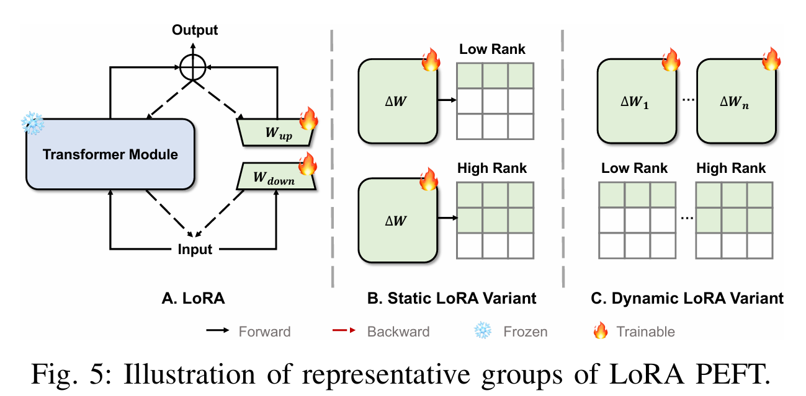
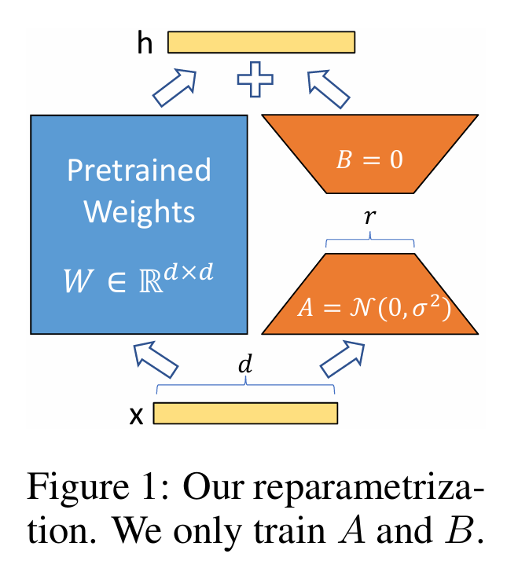
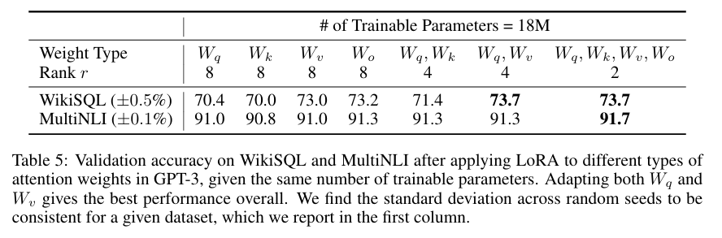
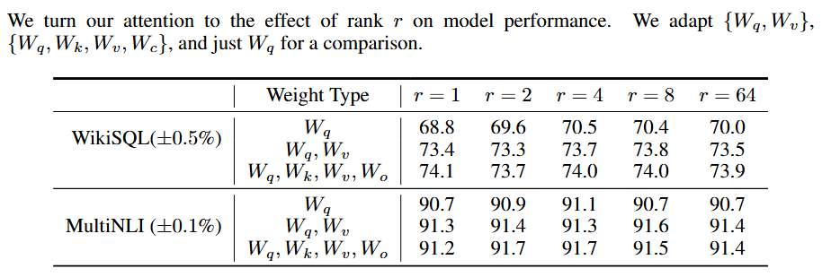
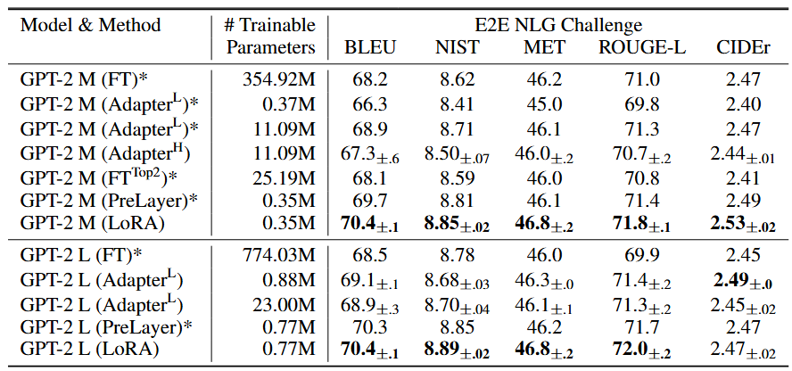
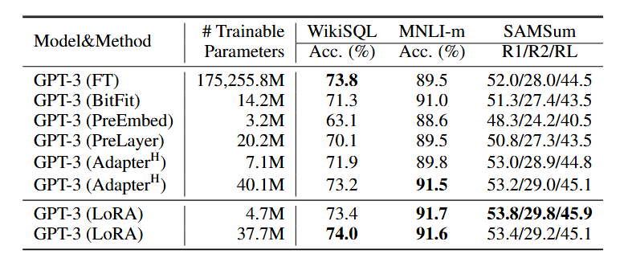
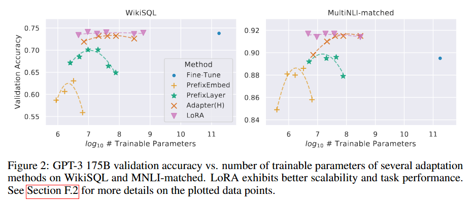
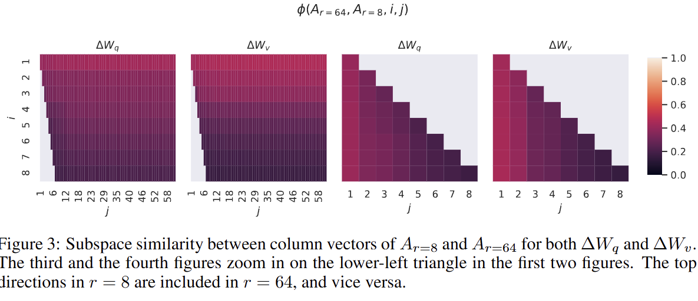
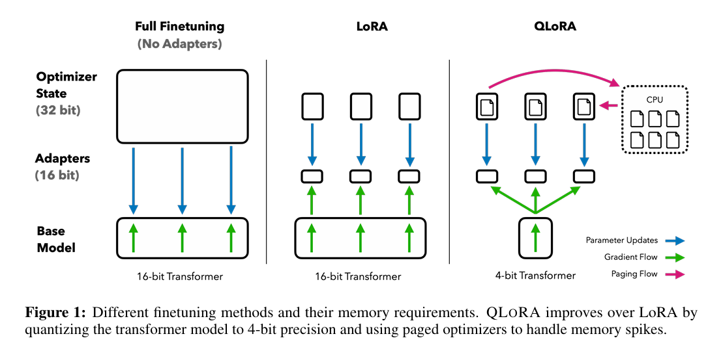

# 重参数化PEFT（Reparameterization PEFT）

重参数化PEFT的核心思想是：**保持模型原有结构和参数数量不变，但通过改变参数的数学表示形式，来实现高效微调。**

### 1. LoRA (Low-Rank Adaptation)⭐

[2106.09685v2.pdf](assets/2106.09685v2-20251030003951-uj1qi01.pdf)

LoRA是重参数化PEFT的奠基之作，它的成功源于一个关键的实证假设：**预训练的大语言模型在进行下游任务微调时，其权重的变化量** **$(\Delta W)$** **具有很低的“内在秩”（intrinsic rank）** 。这意味着，尽管权重矩阵本身非常庞大和复杂，但使其适应新任务所需的“改动”其实非常简单和有规律，可以用一个低秩矩阵来近似。

​

​

​​

1. **标准的全量微调**  
    对于模型中的一个线性层（例如注意力机制中的 $W_q, W_k, W_v$ 或前馈网络中的权重），其前向传播可以表示为：

    $$
    h = W_0 x
    $$

    其中，$W_0 \in \mathbb{R}^{d \times k}$ 是预训练好的权重矩阵。在全量微调中，我们会直接更新 $W_0$，得到一个新的权重矩阵 $W' = W_0 + \Delta W$，其中 $\Delta W$ 就是训练中学习到的更新量。训练 $W_0$ 本身的成本非常高。
2. **LoRA的重参数化**  
    LoRA提出，我们不需要学习包含 $d \times k$ 个参数的完整矩阵 $\Delta W$，而是可以将其分解（重参数化）为两个更小的、低秩的矩阵 $B$ 和 $A$ 的乘积：

    $$
    \Delta W \approx B A
    $$

    其中，$B \in \mathbb{R}^{d \times r}$，$A \in \mathbb{R}^{r \times k}$。这里的 $r$ 就是LoRA的**秩 (rank)** ，它是一个远小于 $d$ 和 $k$ 的超参数（例如 8, 16, 64）。
3. **LoRA的前向传播**  
    因此，带有LoRA的层的前向传播就变成了：

    $$
    h = W_0 x + (\Delta W) x = W_0 x + B A x
    $$

    在整个微调过程中，$W_0$ 始终保持**冻结**状态，我们只训练矩阵 $A$ 和 $B$ 的参数。需要训练的参数数量从 $d \times k$ 锐减到 $d \times r + r \times k = (d+k)r$，当 $r$ 很小时，这个削减是巨大的。
4. **带有缩放因子的公式**  
    在实际应用中，LoRA通常还会引入一个缩放因子 $\alpha$（通常设为与 $r$ 相同或两倍的值），公式变为：

    $$
    h = W_0 x + \frac{\alpha}{r} B A x
    $$

    这个缩放因子 $\frac{\alpha}{r}$ 类似于一个学习率，可以调整更新量的大小，有助于稳定训练。
5. 两个矩阵的初始化：

    在 LoRA 里，设原权重为 $W_0$，微调后的权重写成

    $$
    W = W_0 + \Delta W,\qquad \Delta W = BA
    $$

    其中 $A \in \mathbb{R}^{r \times d_{\text{in}}}$，$B \in \mathbb{R}^{d_{\text{out}} \times r}$。原始 LoRA 论文采用的是：**$A$** **随机初始化，**​**$B$** **零初始化**，这样一开始就有 $\Delta W = BA = 0$。论文里写的是 “random Gaussian for $A$, zero for $B$”；而 Hugging Face PEFT 的常见工程实现则通常把 $A$ 用 **Kaiming-uniform** 初始化、$B$ 置零，本质目标相同：**让初始 LoRA 分支等效于恒等不改动原模型**。

    **原因？**

    - **不破坏原模型**：靠 $BA=0$ 实现。
    - **不让训练停住**：靠“只把一个矩阵设成 0，另一个随机”实现。设上游梯度 $g=\partial \mathcal L/\partial h$

      $$
      \frac{\partial \mathcal L}{\partial B} = g(Ax)^\top,\qquad
      \frac{\partial \mathcal L}{\partial A} = B^\top g x^\top
      $$

      若 $A$ 随机、$B=0$，则初始化时

      $$
      \frac{\partial \mathcal L}{\partial B} = g(Ax)^\top \neq 0,\qquad
      \frac{\partial \mathcal L}{\partial A}=0
      $$

#### **推理时的优势：可合并性**

LoRA的一个巨大优势是，在训练完成后、进行推理部署时，它可以将学习到的低秩矩阵合并回原始权重中，从而**不引入任何额外的推理延迟**。

$$
W' = W_0 + B A
$$

合并后，前向传播恢复为标准形式 $h = W'x$，计算量与原始模型完全相同，但权重 $W'$ 已经包含了在新任务上微调后的知识。

​​

左边两张分别对应：

- $\Delta W_q$
- $\Delta W_v$

它们画的是 **完整的子空间相似度矩阵**：

- 纵轴 $i=1,\dots,8$
- 横轴 $j=1,\dots,64$

也就是说，左边两张把

$$
\phi(A_{r=8},A_{r=64},i,j)
$$

在 **全部** **$i,j$** **组合** 上都画出来了。

所以左边两图回答的是：

> 当 $r=8$ 的前 $i$ 个方向，去和 $r=64$ 的前 $j$ 个方向比较时，整体上相似度怎么变化？

​

**下游任务真正需要的** **$\Delta W$** **不是一个高维、杂乱的更新，而是主要集中在少数几个主方向里**。

#### 估计训练时的显存占用

##### 1. 模型权重

如果底座模型总参数量为 $N$，每个参数占 $b_{\text{base}}$ 字节，则：

$$
M_{\text{weights}} \approx N \cdot b_{\text{base}}
$$

常见情况：

- FP16 / BF16：2 bytes
- INT8：1 byte
- 4bit：0.5 byte 左右

#### 2. LoRA本身

LoRA 本身占多少推理显存

LoRA 参数量如果记作 $N_{\text{LoRA}}$，LoRA 权重精度一般也是 FP16/BF16，那么：

$$
M_{\text{LoRA}} \approx N_{\text{LoRA}} \cdot b_{\text{LoRA}}
$$

通常：

- $b_{\text{LoRA}} = 2$ bytes（FP16/BF16）

如果你前面估出来 LoRA 只有几百万参数，比如 400 万：

$$
4\times 10^6 \times 2 = 8\text{ MB}
$$

也就是说：

> **LoRA 权重本身往往只有几 MB 到几十 MB，通常不是推理显存瓶颈。**

#### 3.KV cache

对 decoder-only LLM，KV cache 大致可以写成：

$$
M_{\text{KV}} \approx 2 \cdot L \cdot B \cdot T \cdot n_{\text{kv}} \cdot d_{\text{head}} \cdot b
$$

其中：

- $L$：层数
- $B$：batch size 或并发序列数
- $T$：当前序列长度（prompt + 已生成 token）
- $n_{\text{kv}}$：KV heads 数
- $d_{\text{head}}$：每个 head 的维度
- $b$：KV cache 数据类型字节数，FP16/BF16 通常 2 bytes
- 前面的 2 是因为要存 **K 和 V**

如果模型没有 GQA/MQA，而是普通 MHA，那么：

$$
n_{\text{kv}} = n_{\text{heads}}
$$

并且因为：

$$
d_{\text{model}} = n_{\text{heads}} \cdot d_{\text{head}}
$$

公式可简化为：

$$
M_{\text{KV}} \approx 2 \cdot L \cdot B \cdot T \cdot d_{\text{model}} \cdot b
$$

### 7B 模型 + FP16/BF16

- 权重：约 14GB
- LoRA：通常几 MB 到几十 MB
- 2k 上下文、batch\=1 的 KV：约 1GB 左右
- 再加余量：整体大约 16GB 左右上下浮动

### 2. QLoRA(Quantized LoRA)

[QLoRA](assets/2305.14314v1-20260414143223-4skuho9.pdf)​

QLoRA是LoRA的一个极其重要的变体，它解决了在使用LoRA时仍然面临的一个巨大挑战：**内存占用**。标准的LoRA虽然只训练少量参数，但仍需要将完整的、高精度（如16位或32位）的基础模型加载到显存中，这对于消费级硬件来说是无法承受的。

QLoRA通过**量化**技术，极大地降低了基础模型的内存占用。

1. **4位量化基础模型**：QLoRA将冻结的预训练权重 $W_0$ 从16位或32位**量化到4位**。它引入了一种名为NF4（4-bit NormalFloat）的特殊数据类型，这种类型对于呈正态分布的权重数据在信息论上是最优的。

    $$
    W_0 \rightarrow W_0^{\text{4bit}}
    $$
2. **训练中的动态反量化**：这是QLoRA的关键。在进行前向和反向传播计算时，4位的权重 $W_0^{\text{4bit}}$ 会被**动态地反量化**到计算所需的精度（例如16位的bfloat16），计算完成后，高精度的权重就被丢弃，显存中始终只保留4位的版本。

    因此，QLoRA的前向传播可以概念化地理解为：

    $$
    h = \text{dequantize}(W_0^{\text{4bit}}) x + B A x
    $$

    反向传播的梯度会流经这个动态反量化的路径，传递给可训练的LoRA适配器 $A$ 和 $B$，但**不会**更新 $W_0^{\text{4bit}}$。

通过这种方式，QLoRA使得在单张消费级显卡（如24GB的3090/4090）上微调拥有数百亿参数的巨型模型成为可能。

---
