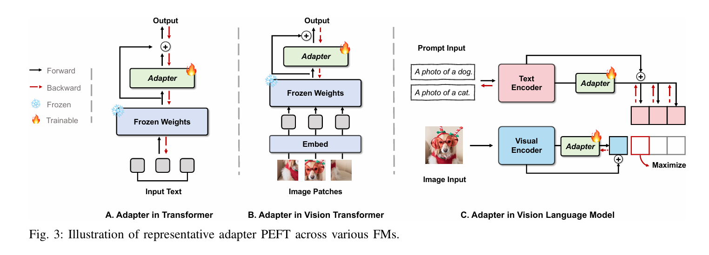
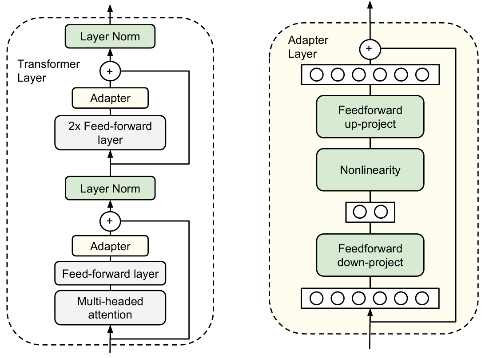
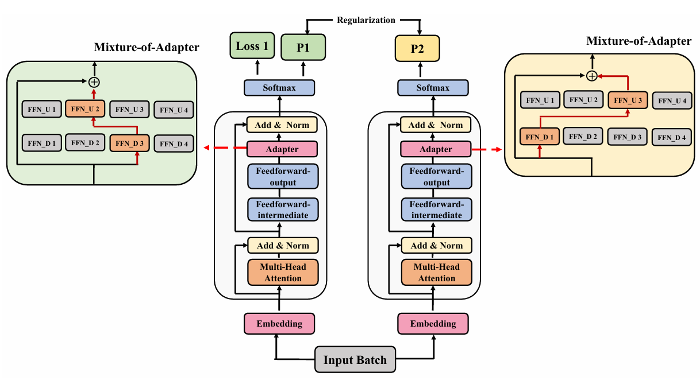
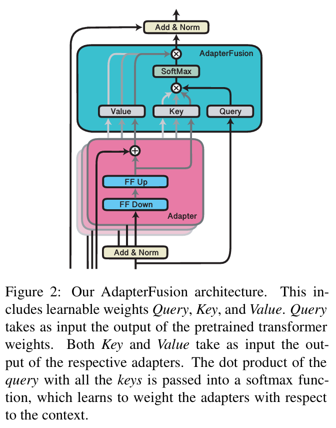

# 附加式PEFT（Additive PEFT）

附加式PEFT的核心思想是**冻结**预训练模型（Foundation Model, FM）的全部原始参数，并通过在其结构中**添加**一些新的、轻量级的、可训练的模块（或参数）来适应下游任务。

### 瓶颈适配器（Bottleneck Adapter）

[1902.00751v2.pdf](assets/1902.00751v2-20260414152211-bm8os1u.pdf)

- **原理**：这是最经典的附加式方法。它在Transformer的每个块（通常在前馈网络FFN之后）中插入一个小型神经网络。这个网络采用了“瓶颈”结构：先通过一个下采样全连接层将高维特征压缩到低维，经过一个非线性激活函数后，再通过一个上采样全连接层恢复到原始维度。同时，它使用残差连接，将适配器的输出与原始输入相加，保证了训练的稳定性。
- **公式**：对于适配器的输入特征$x \in \mathbb{R}^d$，其计算过程可以表示为：

  $$
  \text{Adapter}(x) = W_{\text{up}}(\sigma(x W_{\text{down}}))
  $$

  其中，$W_{\text{down}} \in \mathbb{R}^{d \times m}$ 是下采样矩阵，$W_{\text{up}} \in \mathbb{R}^{m \times d}$ 是上采样矩阵，$\sigma$ 是非线性激活函数（如GeLU或ReLU）。瓶颈维度 $m$ 远小于原始维度 $d$ ($m \ll d$)。完整的带有残差连接的输出为 $x' = x + \text{Adapter}(x)$。

### 多适配器方法（Multi-Adapter）

[2205.12410v2.pdf](assets/2205.12410v2-20260414152414-2upqy0n.pdf)

[2005.00247v3.pdf](assets/2005.00247v3-20260414152632-0p9t2ug.pdf)

- **原理**：这类方法旨在融合来自多个任务的知识。例如AdaMix和AdapterFusion，它们首先为多个源任务分别训练独立的适配器，然后学习一种机制来组合这些适配器，以提升在目标任务上的表现。

  

  

  以AdaMix为例，它将多个适配器视为一个“专家混合”（Mixture-of-Experts, MoE）层。对于第 $i$ 个专家（适配器）$E_i$ 和输入 $x_s$：

  $$
  E_i(x_s) = W_{\text{out}}^{(i)} \text{GeLU}(W_{\text{in}}^{(i)} x_s)
  $$

  然后通过一个门控网络 $G(x_s)$ 来动态地为这些专家分配权重，并加权求和得到最终输出 $h(x_s)$：

  $$
  h(x_s) = \sum_{i} G(x_s)_i \cdot E_i(x_s)
  $$

### 优点（Pros）

- **模块化**：可以为同一个基础模型训练多个轻量级适配器，在切换任务时只需加载对应的适配器即可，极大地节省了存储空间。
- **知识保留**：由于不改动原始参数，可以最大程度地保留预训练模型学到的通用知识，减少灾难性遗忘。

### 缺点（Cons）

- **推理开销 (Inference Overhead)** ：由于在模型中增加了额外的计算层，推理时会引入一定的延迟，尽管延迟通常很小。
- **需要审慎配置 (Prudent Configurations)** ：适配器的性能对其超参数（如瓶颈维度 $m$ 的大小、插入位置等）非常敏感，需要仔细调优。
