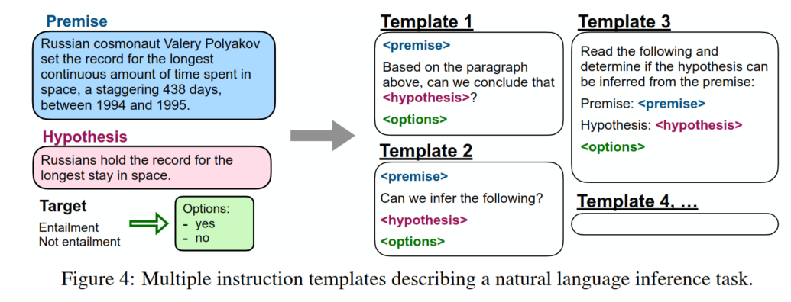

# 训练目标：指令精调（SFT）



[2109.01652v5.pdf](assets/2109.01652v5-20260414160623-es4fc99.pdf)

SFT 的核心做法，是把原本分散在不同任务里的样本统一改写成“自然语言指令 + 模型输出”的形式，让模型学会按照用户的表达方式完成任务。

**原始样本**

> 前提（Premise）  
> 俄罗斯宇航员瓦列里·波利亚科夫创造了人在太空中连续停留时间最长的纪录：在 1994 年到 1995 年间，他连续在太空停留了惊人的 438 天。
>
> 假设（Hypothesis）  
> 俄罗斯人保持着在太空停留时间最长的纪录。
>
> 目标（Target）  
> 蕴含（Entailment）  
> 不蕴含（Not entailment）
>
> 选项（Options）
>
> - 是
> - 否

1. 原本 benchmark 里的标签和字段名偏学术；改成更自然的任务说明后，模型更容易理解“现在要完成什么任务”。
2. 多模板增强也很关键。如果训练时永远只见一种问法，模型容易把能力绑定到固定句式；而多个模板能帮助它学到“不同说法其实对应同一个任务”。

**一句话概括：把大量已有任务统一改写成“自然语言指令模板 + 输出”的 SFT 样本，让模型学会按不同说法执行同一类任务。**

### 指令精调样本

#### 单轮对话

构建一个“指令数据集”，其中包含大量“指令 + 回答”的样本。常见的 SFT 数据集通常包含以下三个字段：

```python
{
    "instruction": "即输入的用户指令",
    "input": "执行该指令可能需要的补充输入，没有则置空",
    "output": "即模型应该给出的回复"
}
```

```python
{
    "instruction": "将下列文本翻译成英文：",
    "input": "今天天气真好",
    "output": "Today is a nice day!"
}
```

#### 多轮对话

```python
<prompt_1><completion_1><prompt_2><completion_2><prompt_3>
<completion_3>
```

```python
input  = <prompt_1><completion_1><prompt_2><completion_2><prompt_3><completion_3>
output = [MASK][MASK][MASK][MASK][MASK]<completion_3>
```

将 $N$ 轮对话构造成 $N$ 个样本：

```python
input_1 = <prompt_1><completion_1>
output_1 = [MASK]<completion_1>

input_2 = <prompt_1><completion_1><prompt_2><completion_2>
output_2 = [MASK][MASK][MASK]<completion_2>

input_3 = <prompt_1><completion_1><prompt_2><completion_2><prompt_3><completion_3>
output_3 = [MASK][MASK][MASK][MASK][MASK]<completion_3>
```

```python
input = 用户：我明天要去上海出差，两天时间，带什么衣服合适？
助手：如果是春秋季，建议带一件薄外套、2件内搭、1条长裤和舒适的运动鞋；如果早晚温差大，再带一件轻便外套。
用户：那需要带雨伞吗？
助手：建议带一把折叠伞。上海天气变化比较快，短时降雨比较常见。
用户：请顺便帮我整理成一个简短的打包清单。
助手：可以，简短清单如下：薄外套1件、内搭2件、长裤1条、运动鞋1双、折叠伞1把、充电器和证件。

output = [MASK][MASK][MASK][MASK][MASK]助手：可以，简短清单如下：薄外套1件、内搭2件、长裤1条、运动鞋1双、折叠伞1把、充电器和证件。
```

### 训练目标

在前面对话历史已经给定的情况下，让模型尽量给第 $t$ 轮的正确回复分配更高概率。

如果把 $a_t$ 再拆成 token 序列：

$$
a_t = (y_1, y_2, \dots, y_m)
$$

那么自回归语言模型会把它写成：

$$
P_{\theta}(a_t \mid c)
=
\prod_{i=1}^{m}
P_{\theta}(y_i \mid c, y_{<i})
$$

这里 $c$ 就是上下文，也就是历史对话加当前用户输入：

$$
c = (u_1, a_1, u_2, a_2, \dots, u_t)
$$

所以训练目标进一步可以写成：

$$
\max_{\theta}
\sum_{i=1}^{m}
\log P_{\theta}(y_i \mid c, y_{<i})
$$

或者等价地，最小化负对数似然：

$$
\mathcal{L}_{\text{SFT}}
=
-\sum_{i=1}^{m}
\log P_{\theta}(y_i \mid c, y_{<i})
$$

这就是最标准的 SFT 目标。

比如一个样本是：

```python
用户：请把“今天天气很好”翻译成英文。
助手：The weather is nice today.
```

从模型角度，这一整条会被拼成一个序列，例如：

$$
[\text{用户：}, \text{请}, \text{把}, \dots, \text{英文}, \text{。}, \text{助手：}, \text{The}, \text{weather}, \dots]
$$

模型不会只“读取前半段再输出后半段”，而是一次性处理这整串 token，产生每个位置的 hidden state 和 logits。

但是，训练时通常不会让前面“用户：请把……”这一段参与损失，而只让“助手：The weather is nice today.”这一段参与损失。于是会配一份 label：

$$
l = (-100, -100, \dots, -100, \text{助手：}, \text{The}, \text{weather}, \dots)
$$

其中 $-100$ 表示这个位置忽略，不算 loss。

所以真正的 SFT 损失是：

$$
\mathcal{L}_{\text{SFT}}
=
-\sum_{i=1}^{n}
\mathbf{1}(l_i \neq -100)\log P_\theta(l_i \mid z_{<i})
$$

- [Local_Transformers_Qwen3_0.6B_LoRA_alpaca_zh_10k_clean.ipynb](assets/Local_Transformers_Qwen3_0.6B_LoRA_alpaca_zh_10k_clean-20260414182202-y1xxjqd.ipynb)
